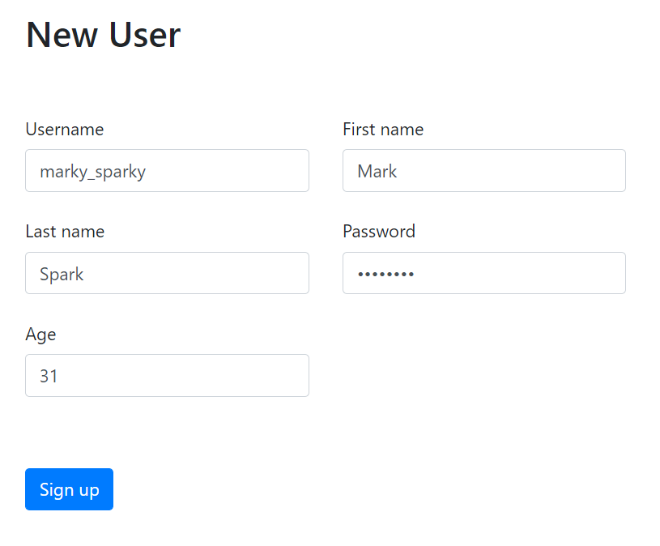
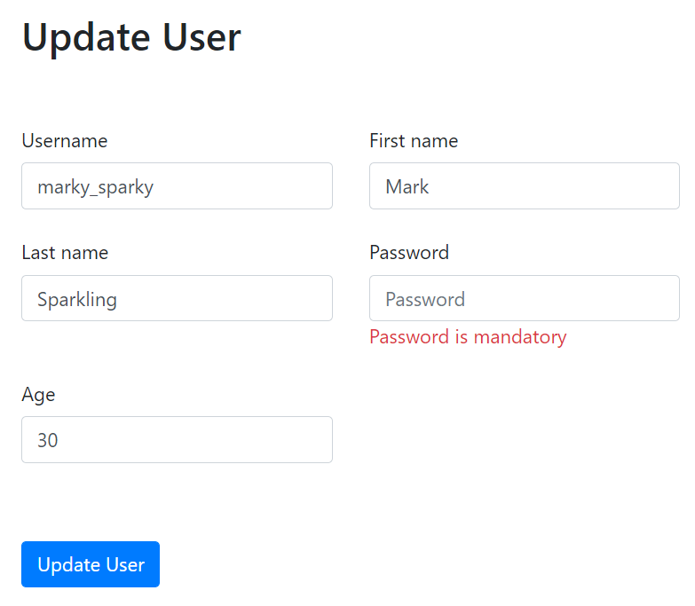
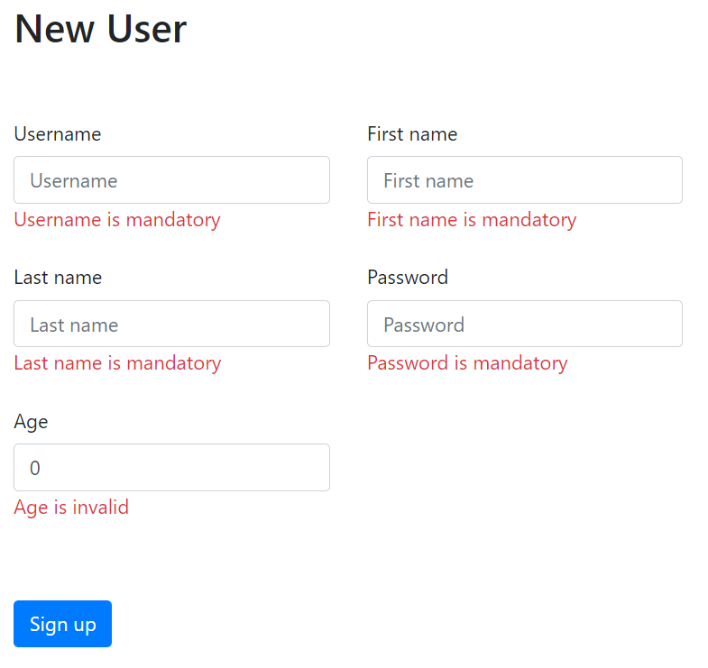
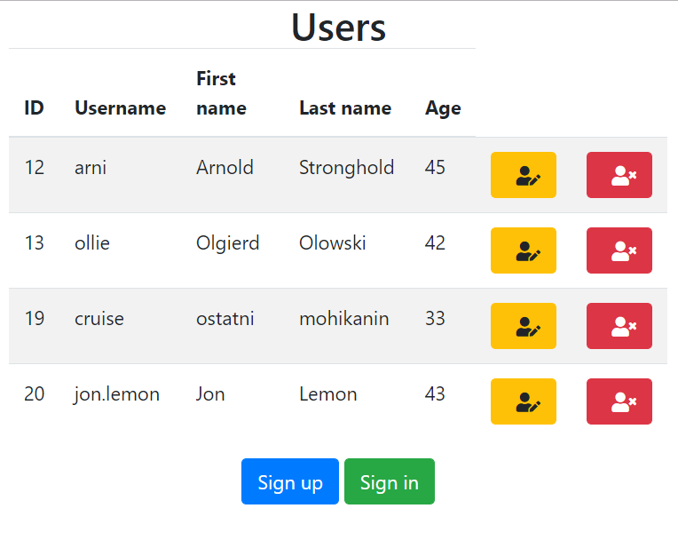
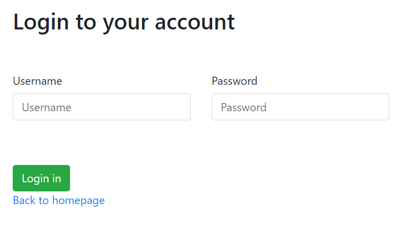

# Contacts-App
> Small web application based on Spring Boot.

> Allows to send basic CRUD requests to connected database via web application.

## Functionalities
* Register new user

* Edit existing user data

* Validate provided user data before inserting a record in the database

* Delete user

* Log in onto existing user's account

## TODO
* Add Spring Security module to maintain login & registration properly
* Provide more functionalities